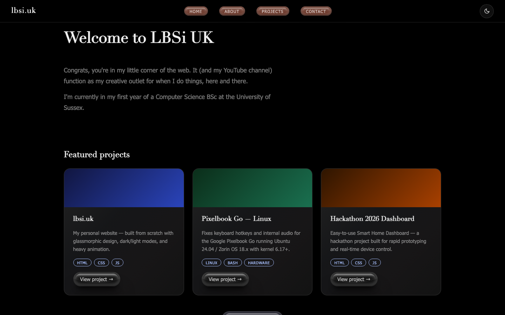
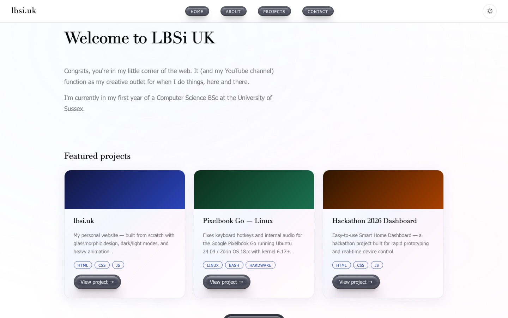
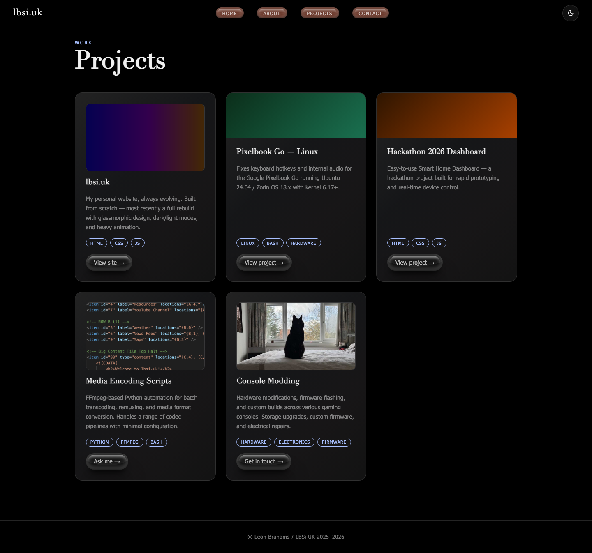
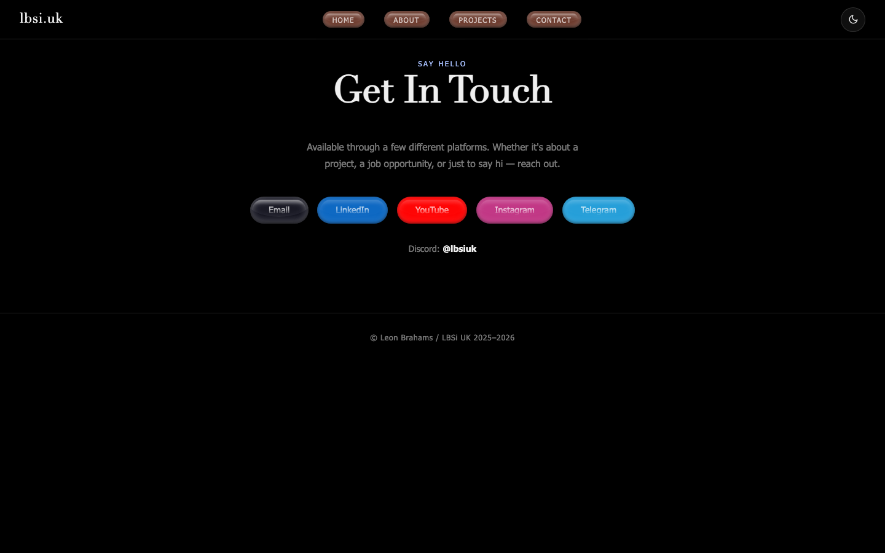
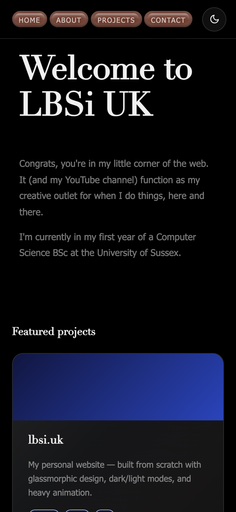
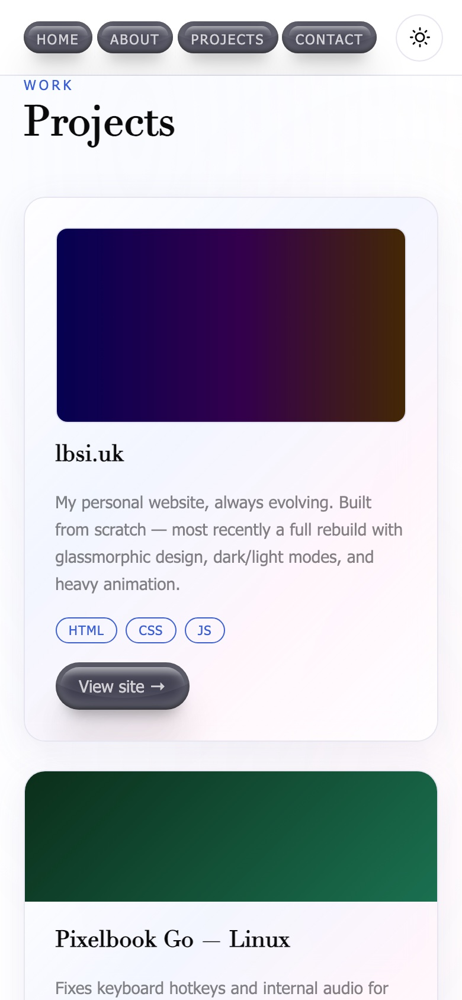
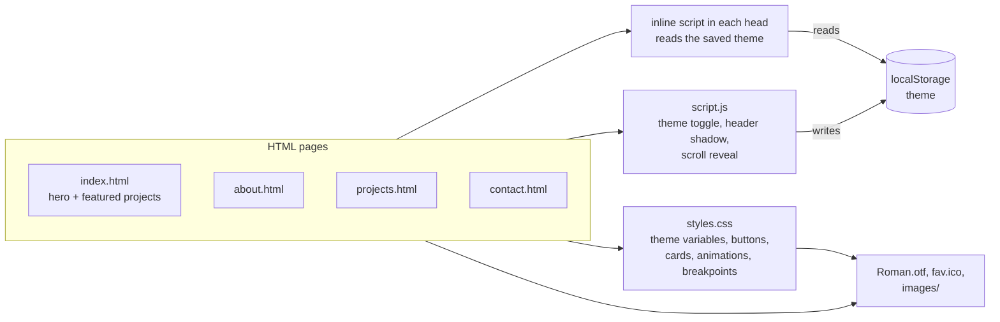

# lbsi.uk unused redesign

A work-in-progress redesign of [lbsi.uk](https://lbsi.uk), Leon Brahams' personal site. It was started to replace
the Windows 8 style tile-grid version of the site in [LBSiUK/lbsiukwebsite](https://github.com/LBSiUK/lbsiukwebsite)
with a simpler layout: a plain black (or white) page, pill-shaped navigation, a light/dark toggle and a few
featured project cards.

It was never finished or put live. A later redesign borrows some ideas from it (along with bits of the Windows 8
version and the original site), and this copy is kept for documentation only. It is provided as is, with no
warranty.

## Screenshots

All screenshots were taken from this repo served locally in headless Chromium.


*Home page, dark theme (the default), at 1440 × 900.*


*Home page after pressing the sun/moon toggle. The choice is remembered across pages.*


*Projects page (full page), dark theme.*


*Contact page, with the brand-coloured pearl buttons.*

| Phone, home (dark) | Phone, projects (light) |
| --- | --- |
|  |  |

*Phone width (390px). Below 720px the logo is hidden and the four nav pills spread across the header.*

## Features

- Four static pages: Home, About, Projects and Contact.
- Light and dark themes. The choice is saved in `localStorage` and applied before the page paints, so there is
  no flash of the wrong theme when moving between pages.
- "Pearl" pill buttons with layered inset shadows, used for the navigation, card links and contact links.
- Frosted-glass project cards with a soft gradient sheen and a lift on hover.
- Load animations: the header and headings wipe in from the top, and cards and paragraphs fade up as they
  scroll into view.
- A slowly drifting background glow in light mode.
- Responsive layout down to 320px wide.

## How to preview it

There is no build step and nothing to install. You need a web browser, and Python 3 if you want a local server.

```sh
git clone https://github.com/LBSiUK/lbsi.uk-unused-redesign.git
cd lbsi.uk-unused-redesign
python3 -m http.server 8000
```

Then open <http://localhost:8000/>. Opening `index.html` straight from disk also works, since every path is
relative.

There are no tests.

## Architecture

It is a plain HTML, CSS and JavaScript site with no framework, bundler or templating. Each page is a complete HTML
file that links the same stylesheet and script.



How the pieces fit together:

- **Theme.** `styles.css` defines its colours as CSS custom properties under `[data-theme="dark"]` and
  `[data-theme="light"]`. A small inline script in each page's `<head>` reads `localStorage.theme` (defaulting to
  dark) and sets `data-theme` on `<html>` before the body renders. The toggle button in `script.js` flips the
  attribute and saves the new value, so the next page picks it up.
- **Header.** The fixed header (logo, nav pills, theme toggle) is copied into each of the four pages rather than
  shared. `script.js` adds a `scrolled` class once the page moves, which gives the header a shadow.
- **Animations.** Elements with `wipe-in` run a CSS clip-path animation on load, staggered with inline
  `animation-delay` values. Elements with `reveal` start transparent and `script.js` adds `in-view` through an
  `IntersectionObserver` when they come on screen.
- **Buttons.** All buttons share one `.btn > .wrap > p` structure. The base style is the pearl button, with
  modifiers for navigation (`btn-nav`), small card links (`btn-sm`), the main call to action (`btn-primary`) and the
  brand-coloured contact links.
- **Fonts.** Headings and the logo use the bundled `Roman.otf` serif. Body text uses a Segoe UI / Tahoma / Verdana
  stack.

### Project layout

| Path | What it is |
| --- | --- |
| `index.html` | Home page: welcome text and three featured project cards |
| `about.html` | About page: short bio, skill chips and a photo |
| `projects.html` | Projects page: five project cards, some with images |
| `contact.html` | Contact page: email and social links |
| `styles.css` | All styling, including both themes and the responsive breakpoints (900px, 720px, 640px, 380px) |
| `script.js` | Theme toggle, header shadow on scroll, scroll-reveal observer, smooth scrolling for `#` links |
| `Roman.otf` | Display serif used for headings and the logo |
| `fav.ico` | Favicon |
| `images/` | Photos and screenshots used on the About and Projects pages |
| `docs/screenshots/` | The screenshots in this README |

## Status and limitations

This is an archived work in progress, kept for reference. Known gaps:

- The header markup is duplicated across the four pages, so any nav change has to be made four times.
- There is no collapsed mobile menu; on phones the four pills are simply squeezed into the header.
- The smooth-scroll handler in `script.js` only acts on `#` links, and none of the pages currently has one.
- On the Contact page the footer sits just below the content rather than at the bottom of a tall window.
- The "lbsi.uk" project cards link out to <https://lbsi.uk> rather than to anything in this repo.
- `images/oldsite.png` is around 1 MB and has not been optimised.
- The page text (studies, projects, contact details) reflects the time it was written and has not been updated.

The original snapshot also sits on the `redesign-wip` branch of
[LBSiUK/lbsiukwebsite](https://github.com/LBSiUK/lbsiukwebsite/tree/redesign-wip), next to the older versions of
the site. This repo holds the redesign on its own.

## Credits

The pearl button style is based on the UIverse.io button "pretty-goose-7" by marcelodolza, as noted in
`styles.css`.
